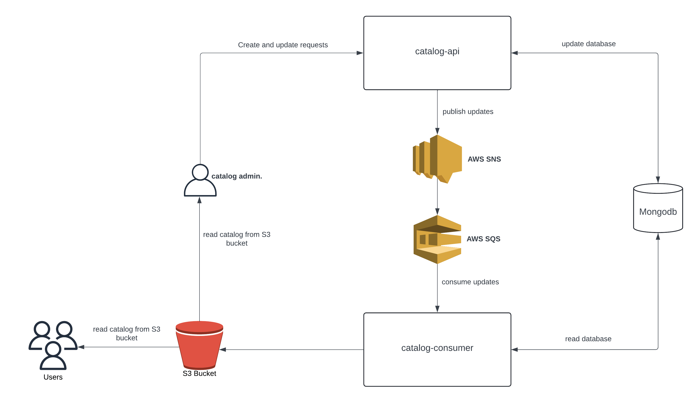

# catalog-system

Esse repositório serve como agregador dos serviços que compõe o `catalog-system`

## Índice

1. [Descrição do Projeto](#descrição-do-projeto)
2. [Arquitetura do Sistema](#arquitetura-do-sistema)
3. [Tecnologias Utilizadas](#tecnologias-utilizadas)

## Descrição do Projeto

O **catalog-system** é um sistema desenvolvido para gerenciar catálogos de produtos para estabelecimentos comerciais. Ele permite que os donos dos estabelecimentos cadastrem e atualizem categorias e produtos via API. Todas as alterações feitas nos catálogos são automaticamente enviadas para uma fila, que é monitorada por um consumidor. Este consumidor atualiza ou cria um documento correspondente no AWS S3, garantindo que o catálogo esteja sempre atualizado e disponível aos consumidores.

Este projeto foi pensado para aplicar conhecimentos de Spring, Mongodb, mensageria e AWS Cloud

## Arquitetura do Sistema

O sistema é composto por três principais componentes:

1. **catalog-api**: Interface RESTful que permite o cadastro e a atualização de donos, categorias e produtos.
2. **Base de dados Mongodb**: Base de dados do sistema que recebe atualizações da api e é lido pelo consumer.
3. **Mensageria com AWS SQS/SNS**: As alterações nos catálogos são publicadas em uma fila SQS, que é então processada por um consumidor.
4. **catalog-consumer**: As mensagens publicadas na fila são lidas por este sistema, lê as atualizações no banco de dados e publica o catalogo atualizado no bucket do S3.
5. **Armazenamento no AWS S3**: O consumidor lê as mensagens da fila e atualiza um documento no AWS S3, refletindo o estado atual do catálogo.

Cada componente do projeto é mantido em um repositório separado, mas este repositório principal serve como ponto de entrada para o projeto como um todo.

- [Link catalog-api](https://github.com/Marco-Birman-Haiat/catalog-api)
- [Link catalog-consumer](https://github.com/Marco-Birman-Haiat/catalog-consumer)

### System Design

## Tecnologias Utilizadas

- **Spring Framework**: Utilizado para gerenciamento de dependências e criação de uma arquitetura modular.
- **MongoDB**: Banco de dados NoSQL usado para armazenar informações dos catálogos.
- **AWS SQS**: Serviço de fila da AWS usado para gerenciar mensagens entre a API e o consumidor.
- **AWS SNS**: Serviço de notificação utilizado para envio de mensagens para a fila.
- **AWS S3**: Serviço de armazenamento utilizado para salvar os documentos de catálogo.
